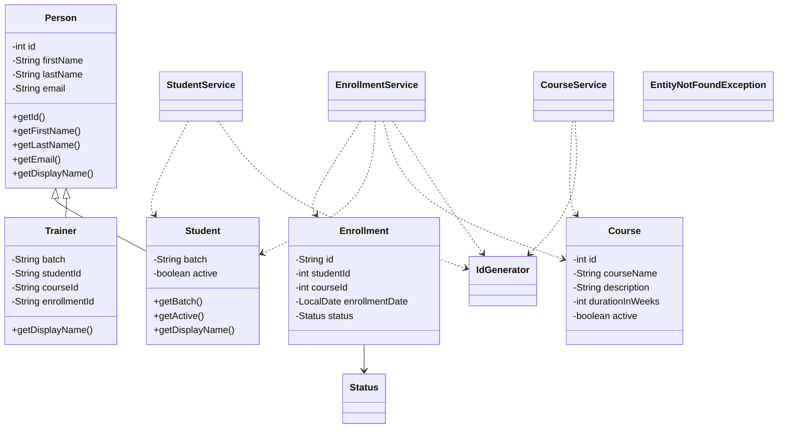

# LearnTrack-Student-Course-Management-System-Java

LearnTrack is a console-based Student, Course, and Enrollment Management System built using Core Java and in-memory `ArrayList` storage.

## Project Description

This project demonstrates core Java concepts through a menu-driven application. It includes student management, course management, and enrollment tracking while also showing encapsulation, inheritance, static utility methods, custom exception handling, and simple clean-code practices.

## Class Diagram



This diagram shows the main inheritance and service relationships used in the project. `Student` and `Trainer` inherit common person details from `Person`, while the service classes manage the in-memory lists and operations for the entities.

## Project Structure

```text
.
|-- docs
|-- pom.xml
|-- README.md
`-- src
    `-- com
        `-- learntrack
            |-- exception
            |-- main
            |-- model
            |-- service
            `-- util
```

## Implemented Features

- Student Management
- Add new student
- View all students
- Search student by ID
- Deactivate a student
- Course Management
- Add new course
- View all courses
- Activate or deactivate a course
- Enrollment Management
- Enroll a student in a course
- View enrollments for a student
- Mark enrollment as completed or cancelled
- Custom `EntityNotFoundException`
- Graceful handling for invalid numeric and menu input

## How to Compile and Run

### IntelliJ IDEA

1. Open this folder in IntelliJ IDEA.
2. Wait for Maven project import from `pom.xml`.
3. Open `src/com/learntrack/main/Main.java`.
4. Run `main.com.airtribe.learntrack.Main`.

### Terminal with `javac`

```powershell
javac -d out (Get-ChildItem src -Recurse -Filter *.java | Select-Object -ExpandProperty FullName)
java -cp out main.com.airtribe.learntrack.Main
```

### Terminal with Maven

```bash
mvn -q compile
mvn -q exec:java -Dexec.mainClass=main.com.airtribe.learntrack.Main
```

## Additional Documentation

- `docs/Setup_Instructions.md`
- `docs/JVM_Basics.md`
- `docs/Design_Notes.md`
